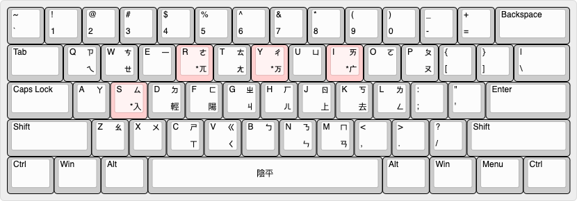
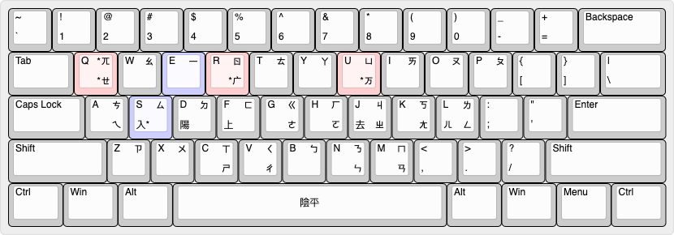

# rime-bepemefeve

以注音字母記錄的「老國音」字音表，可通過RIME輸入法引擎支援多種漢字輸入方案。

以1926年的第三十八版《校改國音字典》爲主要參考，兼收《學生字典》（陸爾奎、方毅，1915）與《國音新詩韻》（趙元任，1922），每條字音均附有出處。

*注音格式：使用聲調符號表示聲調（不使用四聲點法），在字頭加上`·`表示輕音。可能同時寫出原聲調，例如「子」`·ㄗˇ`*

### 目前支援的輸入方案
- [注音 大千兼容式](#5jup)
  -  `./bepemefeve_5jup.schema.yaml`
- [注音 類大千式](#5jup_like)
  -  `./bepemefeve_5jup_like.schema.yaml`
- [注音 倚天兼容式](#eten26ext)
  -  `./bepemefeve_eten26ext.schema.yaml`
- [注音 許氏鍵盤改](#hsukeymod)
  -  `./bepemefeve_hsukeymod.schema.yaml`
- [國語羅馬字](#romatzyh)
  - `./bepemefeve_gr.schema.yaml`
  - `./bepemefeve_gr_atonal.schema.yaml`
  - `./guoqlo.schema.yaml`
- [威翟式拼音（Wade–Giles）](#wade)
  - `./bepemefeve_wg.schema.yaml`
- [趙拼](#zhauping)
  - `./bepemefeve_zhauping.schema.yaml`
- [iac轉寫](#iac)
  - `./bepemefeve_iac_im.schema.yaml`
  - `./bepemefeve_iac_lt.schema.yaml`
- [國音用漢語拼音](#tsinglou)
  - `./bepemefeve_huenhoshi.schema.yaml`

## 基於注音字母的輸入方案

「老國音」需要使用「ㄪ」「ㄫ」「ㄬ」這三個在1932年後被廢棄的聲母，而且多了一個入聲聲調，
現有的注音鍵盤並不能滿足老國音的錄入需要，因此有了以下的替代排列：

### 大千兼容式
不增加按鍵，兼容現有大千式軟鍵盤：
- 合併按鍵：ㄪ/ㄫ/ㄬ <-> ㄒ/ㄑ/ㄖ <-> `V`/`F`/`B`鍵
- 輕聲鍵（數字鍵7）同時兼任入聲鍵：標在字頭爲輕音，標在字尾爲入聲

\
*「大千兼容式」鍵盤排列（高亮的按鍵不同於標準「大千式」）*

配方位置：`./bepemefeve_5jup.schema.yaml`\
碼表位置：`./bepemefeve.dict.yaml`

### 類大千式
鍵盤根據1920年的舊注音字母表順序（ㄪ、ㄦ兩母除外）重新排列：

    1QAZ ㄅㄆㄇㄈ
    2WSX ㄉㄊㄋㄌ
    3EDC ㄍㄎㄫㄏ
    4RFV ㄐㄑㄬㄒ
    5TGB ㄓㄔㄕㄖ
    6YHN ㄗㄘㄙㄦ /* 「ㄦ」跟「ㄖ」在各種拼音方案中經常會共用同字母R，所以放在相鄰位置 */
    7UJM ㄧㄨㄩㄪ /* 「ㄪ」雖然不算介母，但只與「ㄟ」相拼，與「ㄨ」有關，所以放在同一列 */
    8IK, ㄚㄛㄜㄝ
    9OL. ㄞㄟㄠㄡ
    0P;/ ㄢㄣㄤㄥ
    /* ㄪ、ㄦ兩母不依照字母表順序排列 */

    '[-=] 陰陽上去入 /* 按鍵位置如「四聲點法」*/
    /* 陰平聲與輕音共用按鍵`'`，標在字尾爲陰平聲，標在字頭爲輕音 */

\
*「類大千式」鍵盤排列（高亮的按鍵不同於標準「大千式」）*

不同於通常的注音輸入法，本輸入方案以【空格鍵】或 `QWERTYUIOP` 選詞，以`]`和`\`鍵換頁，
而【回車鍵】用於直接輸入拉丁字母、數字等ASCII字符（毋須切換模式）

配方位置：`./bepemefeve_5jup_like.schema.yaml`\
碼表位置：`./bepemefeve.dict.yaml`

### 倚天兼容式
基於倚天26鍵修改，在不增加任何按鍵、盡量不影響現有操作習慣的前提下支援老國音使用的舊式注音符號

* ㄪ - ㄔ - Y
* ㄫ - ㄜ - R
* ㄬ - ㄞ - I
* 入聲 - ㄙ - S

\
*「倚天兼容式」鍵盤排列（高亮的按鍵不同於標準「倚天26鍵」）*

配方位置：`./bepemefeve_eten26ext.schema.yaml`\
碼表位置：`./bepemefeve.dict.yaml`

### 許氏鍵盤改
基於[許氏鍵盤](https://web.archive.org/web/20070214130835/http://www.iis.sinica.edu.tw/IASL/products/going5/chap-ad.html)修改，在盡量不影響現有操作習慣的前提下支援老國音使用的舊式注音符號

* `U` ㄪ ㄪ通常羅馬化V，而V與U之間關係接近
* `Q` ㄫ Q的常見發音/k/的位置同ㄫ。在趙元任的羅馬字設計中，ㄫ亦常常轉寫成Q
* `R` ㄬ ㄬ與ㄖ之間關係接近

用原版許氏鍵盤輸入老國音，ㄓㄝ、ㄔㄝ、ㄕㄝ 會與 ㄐㄧ、ㄑㄧ、ㄒㄧ相混，
因此**ㄧ和ㄝ不再共用E鍵。ㄝ會移到ㄫ的位置，共用Q鍵。**

\
*「許氏鍵盤改」鍵盤排列（高亮的按鍵不同於標準「許氏鍵盤」）*

配方位置：`./bepemefeve_hsukeymod.schema.yaml`\
碼表位置：`./bepemefeve.dict.yaml`

## 羅馬拼音形式的輸入方案

### 國語羅馬字（Gwoyeu Romatzyh）
*別名：國音字母第二式 (1928~)、譯音符號 (1940~)*

輸入法說明：
- 以`x`鍵 或 大寫`E`鍵 輸入`è`（ㄝ）
- 以`q`鍵 輸入 `·`（輕聲）
- `tz`可簡作`z`
  - 因爲`z`字母在G.R.中僅用於拼寫`tz`聲母
  - 上屏爲`ᵗz`
- `ch`可簡作`c`
  - 因爲`c`字母在G.R.中僅用於拼寫`ch`聲母
  - 上屏爲`cʰ`

配方位置：`./bepemefeve_gr.schema.yaml`\
碼表位置：`./bepemefeve.dict.yaml`

**獨立碼表版本：**\
配方位置：`./guoqlo.schema.yaml`\
碼表位置：`./guoqlo.dict.yaml`

**忽略聲調拼寫規則的簡易版本：**\
*＊需要時可以在字尾以數字鍵`6`, `7`, `8`, `9`, `0`標示五聲*\
配方位置：`./bepemefeve_gr_atonal.schema.yaml`\
碼表位置：`./bepemefeve.dict.yaml`

### 威翟式拼音（Wade–Giles）
*別名：威妥瑪拼音、韋翟式拼音、韋傑士羅馬拼音、韋氏拼音*

輸入法說明：
- `ㄬ`母以 `ʻn` 表示
- 字母 `ü` 需要以 ⇧`U` 鍵入；其餘的 `ê`、`ŭ` 用基本字母代替，不會混淆
- 符號 `ʻ` 以 `'` (或 `q` 或 `x`) 鍵入，不可省略
- 隔音符用 `-`
- 以數字鍵`6`、`7`、`8`、`9`、`0`輸入聲調：`1`(陰)、`2`(陽)、`3`(上)、`4`(去)、`5`(入)

配方位置：`./bepemefeve_wg.schema.yaml`\
碼表位置：`./bepemefeve.dict.yaml`

### 當代原創老國音拼音方案

#### 勝爲士：趙音拼音（趙拼）
*全稱：老國音趙音拼音*

拼音方案詳見 [維基學院：老國音趙音拼音方案](https://zh.wikiversity.org/wiki/原創老國音拼音方案/老國音趙音拼音方案)

輸入法說明：
- 分別以數字鍵`6`、`7`、`8`、`9`、`0`輸入聲調：`1`(陰)、`2`(陽)、`3`(上)、`4`(去)、`5`(入)

配方位置：`./bepemefeve_zhauping.schema.yaml`\
碼表位置：`./bepemefeve.dict.yaml`

#### iacobvs：iac轉寫
拼音方案詳見：
* [維基學院：iac轉寫](https://zh.wikiversity.org/wiki/原創老國音拼音方案/iac轉寫)
* [知乎：iac老國音輸入方案](https://zhuanlan.zhihu.com/p/21674298)

輸入法說明：
- 分別以數字鍵`7`、`8`、`9`、`0`輸入聲調：`1`(陰)、`2`(陽)、`3`(上)、`4`(去)
- 入聲用`-q`

特用於輸入法的簡寫形式\
配方位置：`./bepemefeve_iac_im.schema.yaml`\
碼表位置：`./bepemefeve.dict.yaml`

與注音符號一一對應的形式\
配方位置：`./bepemefeve_iac_lt.schema.yaml`\
碼表位置：`./bepemefeve.dict.yaml`

#### 綺檐淸露：國音用漢語拼音
*別名：混合式拼音*

拼音方案詳見 [維基學院：國音用漢語拼音](https://zh.wikiversity.org/wiki/原創老國音拼音方案/國音用漢語拼音)

輸入法說明：
- 分別以數字鍵`6`、`7`、`8`、`9`、`0`輸入聲調：`1`(陰)、`2`(陽)、`3`(上)、`4`(去)、`5`(入)
- 以 `+`鍵（⇧`=`）輸入 符號`+`（表示輕音）

配方位置：`./bepemefeve_huenhoshi.schema.yaml`\
碼表位置：`./bepemefeve.dict.yaml`

