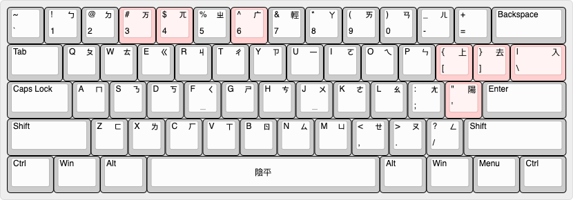

## rime-bepemefeve

以注音字母記錄的「老國音」音碼表，通過RIME輸入法引擎支援多種漢字輸入方案。

以1926年的第三十八版《校改國音字典》爲主要參考，兼收《學生字典》（陸爾奎、方毅，1915）與《國音新詩韻》（趙元任，1922），每條字音均附有出處。\
使用聲調符號表示聲調（不使用四聲點法），在字頭加上`·`表示輕音。可能同時寫出原聲調，例如「子」`·ㄗˇ`

-----

### 基於注音字母的輸入方案
#### 大千式改
鍵盤排列類似「大千式」，並作以下修改：
- `3`、`4`、`6`鍵（原`ˇ`上聲、`ˋ`去聲、`ˊ`陽平）用作輸入ㄪ、ㄫ、ㄬ
- `'`、`[`、`]`、`\`用作輸入 陽平、上、去、入 四聲，陰平聲仍用空格鍵（聲調符號全部移到鍵盤右上角）
- 輕音符號可依照標準寫法標在字頭

配方位置：`.\bepemefeve_5jup.schema.yaml`

-----

### 羅馬拼音形式的輸入方案
#### 國語羅馬字（G.R.／Gwoyeu Romatzyh）
__別名：國音字母第二式、譯音符號__

註：
- 以`X`鍵表示`è`（但在非入聲字中亦可用`E`鍵）
  * 韻母ㄝ`è`在「老國音」中可以與聲母相拼，因此需要單獨編碼。而G.R.在拼寫老國音時，`X`是唯一不用的基本字母
- `tz`可簡作`z`
  * 因爲`z`字母在G.R.中僅用於拼寫`tz`聲母
- `ch`可簡作`c`
  * 因爲`c`字母在G.R.中僅用於拼寫`ch`聲母

配方位置：`.\bepemefeve_gr.schema.yaml`

僅用G.R.的基本形式（不帶聲調）\
配方位置：`.\bepemefeve_gr_atonal.schema.yaml`

### 當代原創老國音拼音方案

#### 勝爲士：老國音趙音拼音（趙拼）
拼音方案詳見 [維基學院：老國音趙音拼音方案](https://zh.wikiversity.org/wiki/原創老國音拼音方案/老國音趙音拼音方案)

配方位置：`.\bepemefeve_zhauping.schema.yaml`

#### iacobvs：iac轉寫
拼音方案詳見 [維基學院：iac轉寫](https://zh.wikiversity.org/wiki/原創老國音拼音方案/iac轉寫)、[知乎：iac老國音輸入方案](https://zhuanlan.zhihu.com/p/21674298)

用於輸入法的簡寫形式\
配方位置：`.\bepemefeve_iac_im.schema.yaml`

與注音符號一一對應的形式\
配方位置：`.\bepemefeve_iac_lt.schema.yaml`

#### 綺檐淸露：國音用漢語拼音（混合式拼音）
拼音方案詳見 [維基學院：國音用漢語拼音](https://zh.wikiversity.org/wiki/原創老國音拼音方案/國音用漢語拼音)

配方位置：`.\bepemefeve_huenhoshi.schema.yaml`
